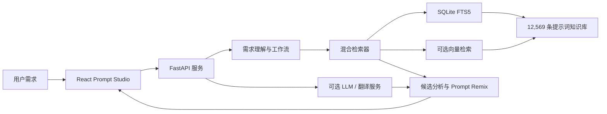

# image2-agentRAG

<div align="center">

面向 GPT Image 2 提示词知识库的 Agentic RAG 检索与编排工作台。

[](https://www.python.org/)
[](https://fastapi.tiangolo.com/)
[](https://react.dev/)
[](https://www.typescriptlang.org/)
[](https://www.sqlite.org/fts5.html)

[快速开始](#快速开始) · [核心能力](#核心能力) · [API](#api) · [部署](#生产部署) · [数据来源](#数据来源与致谢)

</div>

## 项目简介

`image2-agentRAG` 将公开的 GPT Image 2 提示词数据整理为结构化知识库，并提供从自然语言需求理解、混合检索、候选分析到 Prompt 重写的一体化工作流。

项目当前包含 **12,569 条英文提示词**、**11 个应用分类**和完整预览图元数据。基础检索完全可以在本地运行；向量检索、翻译、推荐解释和 Prompt Remix 均可按需接入本地模型或 OpenAI 兼容接口。

## 核心能力

- **Agentic 工作流**：将自然语言需求拆解为主体、动作、场景、风格、构图、镜头、光线和配色等结构化字段。
- **混合检索**：使用 SQLite FTS5 关键词召回与多语种向量召回，并通过 RRF 融合结果。
- **完整 Prompt 检索**：一条提示词就是一个检索单元，不对原始 Prompt 进行固定长度切片。
- **智能候选卡片**：返回匹配理由、最佳使用场景、个性化建议、参考图要求和完整原始 Prompt。
- **多语言体验**：支持中英文界面、中文需求检索英文 Prompt，以及翻译结果缓存。
- **Prompt Remix**：基于选定模板和用户需求生成定制 Prompt，同时保留原始模板用于核对。
- **可选模型依赖**：未配置 LLM 或向量服务时，FTS5 基础检索仍然可用。
- **管理与部署**：提供知识库管理接口、SQLite 持久化、Ubuntu/systemd/Nginx 部署脚本和自动备份方案。

## 系统架构



## 技术栈

| 层级 | 技术 |
| --- | --- |
| 后端 | Python、FastAPI、Pydantic、Typer、HTTPX |
| 检索 | SQLite FTS5、RRF、多语种 Embedding |
| 前端 | React 19、TypeScript、Vite 6 |
| 数据 | JSONL、SQLite |
| 测试 | Pytest |
| 部署 | systemd、Nginx、Certbot |

## 项目结构

```text
image2-agentRAG/
├── data-source/        # 上游提示词画廊数据（Git 子模块）
├── search-source/      # 上游结构化检索数据（Git 子模块）
├── knowledge-base/     # 标准化 JSONL、分类元数据与同步脚本
├── prompt-rag/         # FastAPI 服务、CLI、React 前端、测试与部署脚本
├── .gitmodules
└── README.md
```

## 快速开始

### 1. 环境要求

- Git
- Python 3.11 或更高版本
- [uv](https://docs.astral.sh/uv/)
- Node.js 当前 LTS 版本与 npm

### 2. 克隆仓库

项目使用 Git 子模块，请使用：

```powershell
git clone --recurse-submodules https://github.com/f3271174706-tech/image2-agentRAG.git
Set-Location image2-agentRAG
```

如果已经执行过普通克隆，可补充初始化子模块：

```powershell
git submodule update --init --recursive
```

### 3. 安装后端

```powershell
Set-Location prompt-rag
uv venv .venv
uv pip install --python .venv\Scripts\python.exe -e ".[dev]"
Copy-Item .env.example .env
```

默认配置使用 SQLite FTS5，不要求 API Key。

### 4. 构建前端

```powershell
npm --prefix web-v2 install
npm --prefix web-v2 run build
```

### 5. 建立索引并启动

```powershell
.\.venv\Scripts\prompt-rag.exe ingest
.\.venv\Scripts\prompt-rag.exe serve
```

启动后访问：

- Prompt Studio：<http://127.0.0.1:8010/v2/>
- 知识库管理：<http://127.0.0.1:8010/manage>
- OpenAPI 文档：<http://127.0.0.1:8010/docs>
- 健康检查：<http://127.0.0.1:8010/api/health>

## 常用命令

在 `prompt-rag` 目录执行：

```powershell
# 仅建立 FTS5 索引
.\.venv\Scripts\prompt-rag.exe ingest

# 建立 FTS5 与向量索引
.\.venv\Scripts\prompt-rag.exe ingest --with-embeddings

# 命令行检索
.\.venv\Scripts\prompt-rag.exe search "cyberpunk avatar" --top-k 3

# 启动 API 与 Web 工作台
.\.venv\Scripts\prompt-rag.exe serve
```

## 启用向量检索

### 本地多语种模型

```powershell
uv pip install --python .venv\Scripts\python.exe -e ".[local,dev]"
```

在 `.env` 中设置：

```dotenv
PROMPT_RAG_EMBEDDING_PROVIDER=sentence-transformers
PROMPT_RAG_EMBEDDING_MODEL=intfloat/multilingual-e5-small
PROMPT_RAG_MODEL_CACHE_DIR=./data/models
```

### OpenAI 兼容接口

```dotenv
PROMPT_RAG_EMBEDDING_PROVIDER=openai-compatible
PROMPT_RAG_EMBEDDING_BASE_URL=https://your-provider.example.com/v1
PROMPT_RAG_EMBEDDING_API_KEY=your-api-key
PROMPT_RAG_EMBEDDING_MODEL=your-embedding-model
PROMPT_RAG_EMBEDDING_DIMENSIONS=1024
```

> [!IMPORTANT]
> `.env`、数据库、模型缓存和运行日志已被 Git 忽略。请勿把真实 API Key 写入源码、前端代码或提交记录。

## API

| 方法 | 路径 | 用途 |
| --- | --- | --- |
| `GET` | `/api/health` | 检查服务、索引与模型能力 |
| `GET` | `/api/stats` | 查看提示词、分类与向量统计 |
| `POST` | `/api/workflow-runs` | 解析自然语言需求并创建工作流 |
| `PUT` | `/api/workflow-runs/{id}/requirements` | 保存确认后的结构化需求 |
| `POST` | `/api/search` | 执行关键词或混合检索 |
| `POST` | `/api/analyze-results` | 分析最多三个候选 Prompt |
| `POST` | `/api/translate` | 翻译知识库 Prompt 并缓存结果 |
| `POST` | `/api/recommend` | 检索并生成推荐解释 |
| `POST` | `/api/remix` | 基于模板生成定制 Prompt |

完整请求模型和在线调试入口见启动后的 `/docs`。

### 检索示例

```powershell
$body = @{
  query = "做一个霓虹赛博朋克头像"
  top_k = 3
  categories = @("profile-avatar")
  need_reference_images = $false
  use_dense = $true
} | ConvertTo-Json

Invoke-RestMethod `
  -Uri "http://127.0.0.1:8010/api/search" `
  -Method Post `
  -ContentType "application/json" `
  -Body $body
```

## 测试与构建

```powershell
Set-Location prompt-rag
$env:PYTHONPATH = "$PWD\src"
.\.venv\Scripts\python.exe -m pytest
npm --prefix web-v2 run build
```

当前测试基线：**31 passed**。

## 更新知识库

在 `knowledge-base` 目录执行：

```powershell
python -m pip install -r requirements.txt
python scripts\normalize.py   # 全量标准化
python scripts\sync.py        # 增量同步
python scripts\validate.py    # 数据校验
```

主知识库位于 `knowledge-base/normalized/prompts.jsonl`。同步过程通过稳定来源 ID 和内容哈希聚合去重，并将上游删除记录标记为非活动状态。

## 生产部署

项目提供面向 Ubuntu 22.04/24.04 的私有服务器部署方案，使用 systemd 管理服务，Nginx 提供 HTTPS、Basic Auth 和 API 限流，并通过定时器备份 SQLite。

详细步骤见 [部署文档](prompt-rag/deploy/DEPLOYMENT.md)。

## 数据来源与致谢

提示词数据来自 YouMind OpenLab 的公开项目：

- [awesome-gpt-image-2](https://github.com/YouMind-OpenLab/awesome-gpt-image-2)
- [gpt-image-2-prompts-search](https://github.com/YouMind-OpenLab/gpt-image-2-prompts-search)

两个上游项目以 Git 子模块形式保留各自提交历史和许可文件。本仓库中的标准化数据与检索服务建立在这些公开数据之上，感谢原作者和社区贡献者。

## 贡献

欢迎提交 Issue 或 Pull Request。提交代码前请至少完成：

```powershell
$env:PYTHONPATH = "$PWD\prompt-rag\src"
.\prompt-rag\.venv\Scripts\python.exe -m pytest .\prompt-rag\tests
npm --prefix prompt-rag\web-v2 run build
```

提交新功能时，请同步更新测试和相关文档；不要提交 `.env`、本地数据库、模型文件、日志或构建产物。
