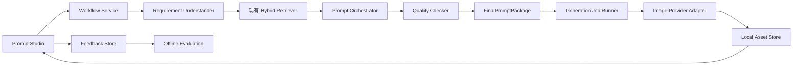

# Prompt RAG 第二阶段规划

> 执行状态（2026-07-14）：P2.0/P2.1 首个垂直切片已实现 RequirementSpec、
> workflow run 持久化、需求理解缓存、用户确认 API 和前端确认界面。资产、生成 job
> 状态机和多模板编排仍按后续交付顺序执行。

## 1. 阶段目标

在不重写现有检索系统和前端的前提下，把当前的：

> 输入需求 → 检索候选 → 选择模板 → Prompt 重写

扩展为可审计、可生成、可反馈的完整闭环：

> 需求结构化 → 混合检索 → 多模板编排 → 质量检查 → 用户确认 → 图像生成 → 结果反馈

第二阶段完成后，系统应能说明“理解了什么、采用了哪些模板、修改了什么、为何通过质量检查”，并可选调用图像模型生成结果。

## 2. 本阶段范围

### 纳入

- 把自然语言需求转换为可编辑的 `RequirementSpec`。
- 为参考图片建立安全的本地资产管理能力。
- 支持一个主模板和多个模板片段共同参与编排。
- 输出结构化 `FinalPromptPackage`，而不只是一段文本。
- 增加确定性规则和 LLM 两层质量检查。
- 通过独立适配器调用 GPT Image 2。
- 保存生成记录、采用/不采用、评分和修改历史。
- 建立离线评测集和关键质量指标。

### 暂不纳入

- 不迁移 Qdrant；当前 12,569 条数据继续使用 SQLite FTS5 和现有向量索引。
- 不做账号、团队空间、权限和云端同步。
- 不引入 Redis、Celery、Kafka 或微服务。
- 不做 Responses API 多轮连续改图。
- 不根据用户反馈自动修改线上排序权重；先收集数据并离线评估。
- 不重写当前 React 工作台，只增加新的状态和结果区域。

## 3. 推荐架构



核心原则：检索、编排、质量检查和图像生成保持独立边界。任何模型都通过适配器调用，前端永远不接触 API 密钥。

## 4. 核心数据契约

### RequirementSpec

```json
{
  "raw_request": "用户原始需求",
  "use_case": "game-key-visual",
  "subject": {"description": "机甲猎人", "action": "站立"},
  "environment": "雨夜霓虹城市",
  "style": ["现代电影感", "科幻"],
  "composition": "中心构图",
  "camera": {"shot": "wide", "lens": "35mm"},
  "lighting": ["霓虹侧光", "体积雾"],
  "palette": ["深蓝", "洋红"],
  "text": {"content": "", "must_be_exact": true},
  "references": [
    {"asset_id": "asset_xxx", "role": "subject", "preserve": ["identity", "clothing"]}
  ],
  "negative_constraints": [],
  "output": {
    "model": "gpt-image-2",
    "ratio": "16:9",
    "size": "1536x864",
    "quality": "low",
    "count": 1,
    "format": "png",
    "prompt_language": "zh"
  },
  "assumptions": [],
  "missing_fields": [],
  "confidence": 0.0,
  "schema_version": 1
}
```

`assumptions` 和 `missing_fields` 必须可见，避免模型把猜测伪装成用户要求。用户修改后的结构化结果才是后续检索和编排的唯一输入。

### FinalPromptPackage

```json
{
  "run_id": "run_xxx",
  "final_prompt": "最终可用提示词",
  "prompt_language": "zh",
  "source_templates": [
    {"prompt_id": "prompt_xxx", "role": "base", "contributed_fields": ["composition", "camera"]}
  ],
  "filled_arguments": {},
  "quality_report": {
    "passed": true,
    "score": 0.0,
    "checks": [],
    "warnings": [],
    "model_compatibility": []
  },
  "version": 1
}
```

## 5. Prompt 编排策略

不要直接让 LLM 拼接三条完整提示词。推荐流程：

1. Top 30 混合召回，继续沿用当前 RRF。
2. 重排到 Top 5，保留分数构成和过滤原因。
3. 选择一个结构最完整的主模板。
4. 从其他候选中只选取明确片段：风格、构图、光线、镜头、材质或限制条件。
5. 先填写模板参数，再做一次整体重写。
6. 输出来源映射，记录每个片段贡献了什么。
7. 质量检查失败时只修复失败字段，不重新自由生成整段 Prompt。

模板结构分析先采用“Top 候选按需分析并缓存”，不在第一批实现中离线分析全部 12,569 条数据。

## 6. 质量检查

### 确定性检查

- 是否仍有未填写的 `{argument ...}`。
- 主体、用途、画幅、输出数量是否完整。
- 画面文字是否与用户输入完全一致。
- 是否同时出现互斥的构图、时间、天气或风格。
- 参考图数量、角色数量和输出数量是否一致。
- 尺寸、格式、质量和背景是否被目标模型支持。
- 最终 Prompt 是否遗漏用户禁止项。

### LLM 检查

- 视觉叙事是否连贯。
- 模板痕迹是否覆盖用户主体。
- 是否出现无来源的新品牌、人物或场景。
- 构图、镜头、光线和风格是否互相支持。

LLM 检查只返回结构化诊断，不直接覆盖最终 Prompt。修复动作必须单独执行并保存版本。

## 7. 图像生成方案

第一版使用 Image API 调用 `gpt-image-2`，原因是它适合单次生成和编辑；Responses API 更适合以后增加的连续对话式改图。官方文档同时说明 GPT Image 2 支持图像输入、编辑和灵活尺寸，但不支持透明背景。

推荐预设：

| UI 预设 | quality | 用途 |
|---|---|---|
| 草图 | low | 快速验证构图，默认值 |
| 标准 | medium | 正式预览 |
| 成品 | high | 用户明确确认后使用 |

画幅映射：

| 画幅 | 默认尺寸 |
|---|---|
| 1:1 | 1024x1024 |
| 16:9 | 1536x864 |
| 9:16 | 864x1536 |
| 4:3 | 1536x1152 |
| 3:4 | 1152x1536 |

生成任务必须异步化：

- `POST /api/generation-jobs`：创建任务，立即返回 `202 + job_id`。
- `GET /api/generation-jobs/{job_id}`：读取状态和结果。
- `GET /api/generation-jobs/{job_id}/events`：SSE 推送排队、生成、完成或失败状态。
- 首版保存最终图片；流式 partial image 作为后续增强，不作为首版阻塞项。

参考：[OpenAI Image generation guide](https://developers.openai.com/api/docs/guides/image-generation)、[GPT Image 2 model](https://developers.openai.com/api/docs/models/gpt-image-2)。

## 8. 本地存储与数据表

继续使用 SQLite，图片文件不存入数据库。

- `workflow_runs`：原始需求、RequirementSpec、当前阶段、最终包和版本。
- `run_sources`：一次运行采用的模板、片段类型和贡献字段。
- `assets`：输入/输出图片的 MIME、尺寸、SHA-256、本地相对路径。
- `generation_jobs`：提供方、模型、参数、状态、错误码和 provider request ID。
- `feedback`：采用/不采用、评分、备注和修改版本。

文件目录：

```text
data/assets/
  input/{asset_id}/original.ext
  output/{job_id}/{asset_id}.png
```

上传时校验真实图片格式、尺寸和文件大小；使用 UUID 路径，忽略用户文件名；API 密钥、完整鉴权头和图片 base64 不进入日志。

## 9. 错误与恢复

- `429`、网络错误和 `5xx` 可进行有上限的指数退避。
- 参数错误、图片格式错误和安全拦截不自动重试。
- 保存提供方 request ID 和稳定错误码，前端显示可操作的中文提示。
- 服务重启后将 `running` 任务标记为 `interrupted`，允许用户重新提交。
- 生成失败不影响已经完成的 RequirementSpec、检索结果和 FinalPromptPackage。

## 10. 评测与验收

建立至少 60 条固定需求，覆盖 11 个知识库分类、中文短查询、长需求、文字海报、参考图需求和互斥条件。

| 指标 | 首版门槛 |
|---|---|
| 检索 Recall@5 | 不低于当前基线 |
| 用户字段覆盖率 | ≥ 95% |
| 未填 argument | 0 |
| 明确约束遗漏率 | ≤ 3% |
| 自相矛盾率 | ≤ 3% |
| 同一输入可复现结构 | ≥ 95% |
| 非生成链路 P95 | ≤ 30 秒 |
| 任务状态可恢复率 | 100% |

生成图片的审美质量不只用自动分数判断；首版记录人工“采用/不采用”和 1～5 分评分作为真实指标。

## 11. 交付顺序

### P2.0：契约与持久化

- Pydantic 模型、SQLite 迁移、run/asset/job 状态机。
- API 错误格式和版本字段。
- 不改变现有页面默认路径。

验收：服务重启后，运行记录和状态仍可正确读取。

### P2.1：需求理解与确认

- 文本需求生成 RequirementSpec。
- 前端展示模型理解、假设和缺失字段，允许用户修改确认。
- 确认后才进入检索。

验收：60 条评测集字段覆盖率达到门槛，模型猜测可追踪。

### P2.2：多模板编排与质量检查

- 主模板 + 有来源的片段合并。
- FinalPromptPackage 和版本记录。
- 确定性检查、LLM 诊断和定向修复。

验收：不存在未填参数，约束遗漏和矛盾率达到门槛。

### P2.3：GPT Image 2 生成适配器

- 本地资产、异步 job、Image API 适配器和结果画廊。
- 草图/标准/成品预设。
- 失败分类、重试和重新提交。

验收：单次生成闭环可用，刷新页面后结果仍存在。

### P2.4：反馈与离线评测

- 采用/不采用、评分、备注和修改历史。
- 固定评测命令和回归报告。
- 只输出排序改进建议，不自动修改线上权重。

验收：每次检索或编排改动都能运行同一套回归评测。

## 12. 开工前默认决策

若无特别调整，建议采用以下默认值：

1. 继续单机、单用户、本地文件存储。
2. RequirementSpec 文本理解先复用现有 MiMo；图像能力和生成能力通过独立 OpenAI 适配器提供。
3. 图像生成默认“草图 / low / 1 张”，成品质量由用户主动选择。
4. 先实现 Image API 单轮生成；多轮连续改图不进入第二阶段。
5. 先做 P2.0 和 P2.1，验收通过后再接入实际图像费用。
